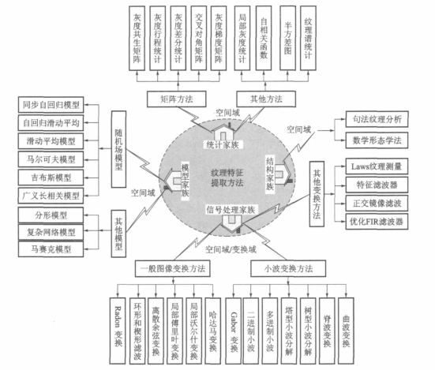

图像纹理特征总体简述
==

纹理是一种反映图像中同质现象的视觉特征，它体现了物体表面的具有缓慢变化或者周期性变化的表面结构组织排列属性

纹理具有三大标志：

- 某种局部序列性不断重复
- 非随机排列
- 纹理区域内大致为均匀的统一体

    不同于灰度、颜色等图像特征，纹理通过像素及其周围空间邻域的灰度分布来表现，即局部纹理信息。另外，局部纹理信息不同程度上的重复性，就是全局纹理信息。

纹理特征体现全局特征的性质的同时，它也描述了图像或图像区域所对应景物的表面性质。但由于纹理只是一种物体表面的特性，并不能完全反映出物体的本质属性，所以仅仅利用纹理特征是无法获得高层次图像内容的。与颜色特征不同，纹理特征不是基于像素点的特征，它需要在包含多个像素点的区域中进行统计计算。在模式匹配中，这种区域性的特征具有较大的优越性，不会由于局部的偏差而无法匹配成功。

在检索具有粗细、疏密等方面较大差别的纹理图像时，利用纹理特征是一种有效的方法。但当纹理之间的粗细、疏密等易于分辨的信息之间相差不大的时候，通常的纹理特征很难准确地反映出人的视觉感觉不同的纹理之间的差别。例如，水中的倒影，光滑的金属面互相反射造成的影响等都会导致纹理的变化。由于这些不是物体本身的特性，因而将纹理信息应用于检索时，有时这些虚假的纹理会对检索造成“误导”。

纹理特征的特点
==

优点： 

- 包含多个像素点的区域中进行统计计算
- 常具有旋转不变性
- 对于噪声有较强的抵抗能力
缺点：

- 当图像的分辨率变化的时候，所计算出来的纹理可能会有较大偏差
- 有可能受到光照、反射情况的影响
- 从2-D图像中反映出来的纹理不一定是3-D物体表面真实的纹理

常用的特征提取与匹配方法
==

纹理特征的提取，一般都是通过设定一定大小的窗口，然后从中取得纹理特征。然而窗口的选择，存在着矛盾的要求：

- 窗口设定大：纹理是一个区域概念，它必须通过空间上的一致性来体现。观察窗口取的越大，能检测出同一性的能力愈强；反之，能力愈弱；
- 窗口设定小：由于不同纹理的边界对应于区域纹理同一性的跃变，因此为了准确地定位边界，要求将观察窗口取得小一点；
这种情况下，会出现困难是：窗口太小，则会在同一种纹理内部出现误分割；而分析窗太大，则会在纹理边界区域出现许多误分割。

- 统计方法
- 几何法
- 模型法
- 信号处理法
- 结构方法

统计方法
--

基于像元及其邻域的灰度属性,研究纹理区域中的统计特性,或像元及其邻域内的灰度的一阶 、二阶或高阶统计特性。

算法：

- 灰度共生矩阵(GLCM),关键特征（能量、惯性、熵、相关性）
- 从图像的自相关函数（即图像的能量谱函数）提取纹理特征，即通过对图像的能量谱函数的计算，提取纹理的粗细度及方向性等特征参数
- 半方差图，该方法是一种基于变差函数的方法 , 由于变差函数反映图像数据的随机性和结构性 , 因而能很好地表达纹理图像的特征 。

优势：
- 方法简单
- 易于实现
- GLCM方法是公认的有效方法
- 具有较强的适应能力和鲁棒性。

缺点：
- 与人类视觉模型脱节,缺少全局信息的利用,难以研究纹理尺度间像素的遗传或依赖关系
- 缺乏理论支撑
- 计算复杂度很高,制约了其实际应用

几何法（应用发展受限，后续研究少）
--

建立在纹理基元（基本的纹理元素）理论基础上的一种纹理特征分析方法。纹理基元理论认为，复杂的纹理可以由若干简单的纹理基元以一定的有规律的形式重复排列构成。

算法：

- Voronio棋盘格特征法

模型法
--

在模型法中,假设纹理是以某种参数控制的分布模型方式形成的,从纹理图像的实现来估计计算模型参数,以参数为特征或采用某种分类策略进行图像分割,因此模型参数的估计是该家族方法的核心问题。

算法（随机场模型法）：

- 马尔可夫随机场（MRF）模型法
- Gibbs随机场模型法
- 分形模型和自回归模型

优势：

- 能够兼顾纹理局部的随机性和整体上的规律性，并且具有很大的灵活性
- 采用随机场模型法对遥感影像纹理特征进行描述并在此基础上进行分割,在很大程度上符合或反映了地学规律
- MRF的主要优点是提供了一种一般而自然的用来表达空间上相关随机变量之间的相互作用的模型
- ,结合图像的分层理论,发展了分层MRF方法、多分辨率MRF方法等,不但可以提高处理效率,而且研究纹理尺度间像素的遗传或依赖关系以取得纹理特征

缺点：

- 难度大，由于主要是通过模型系数来标识纹理特征,模型系数的求解有难度
- 速度慢，由于基于MRF模型的纹理图像分割是一个迭代的优化过程,它由局部到全局的收敛速度很慢(即使条件迭代模式(ICM)能加速寻找解),因而需要很大的计算量,通常需要迭代数百次才能收敛
- 调参难，参数调节不方便,模型不宜复杂

信号处理法
--

信号处理的方法是建立在时、频分析与多尺度分析基础之上,对纹理图像中某个区域内实行某种变换后,再提取保持相对平稳的特征值,以此特征值作为特征表示区域内的一致性以及区域间的相异性。

算法：
- 灰度共生矩阵
- Tamura纹理特征
- 自回归纹理模型
- 小波变换

优势：

- 细尺度分析，对纹理进行多分辨表示,能在更精细的尺度上分析纹理
- 小波符合人类视觉特征，由此提取的特征也是有利于纹理图像分割的;能够空间/频域结合分析纹理特征

不足：

- 对非规则纹理又似乎无能为力，多应用于标准或规则纹理图像，对背景复杂的自然图像效果不佳
- 计算量大

结构方法
--

结构分析方法认为纹理是由纹理基元的类型和数目以及基元之间的“重复性”的空间组织结构和排列规则来描述,且纹理基元几乎具有规范的关系 ,假设纹理图像的基元可以分离出来,以基元特征和排列规则进行纹理分割。显然确定与抽取基本的纹理基元以及研究存在于纹理基元之间的“重复性”结构关系是结构方法要解决的问题。由于结构方法强调纹理的规律性,较适用于分析人造纹理,而真实世界的大量自然纹理通常是不规则的,且结构的变化是频繁的,因此对该类方法的应用受到很大程度的限制。

算法：
- 句法纹理描述算法
- 数学形态学方法

